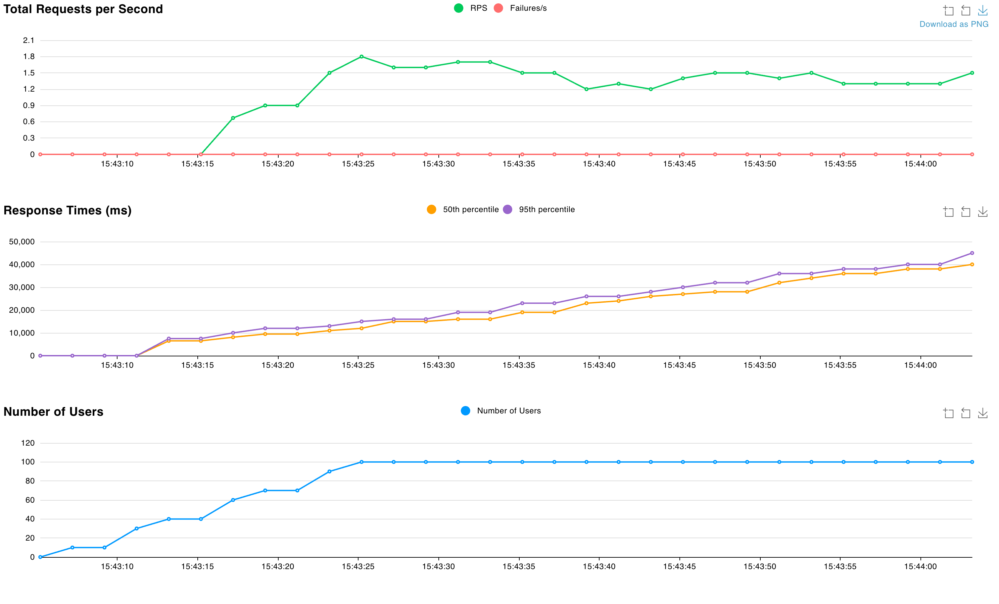
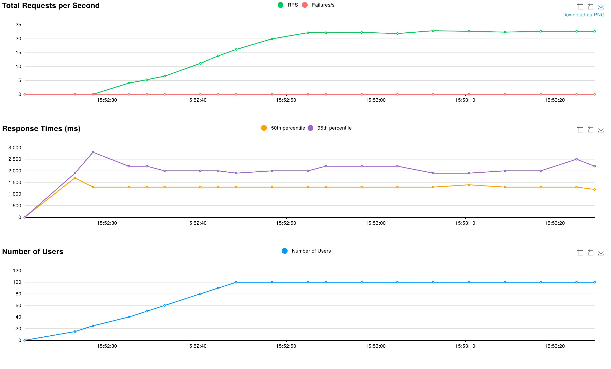

# Movie Recommendation Bot

A FastAPI application that provides a chat interface for the agent which can assist the user to choose the film to watch based on their preferences.

## Prerequisites


### uv Package Manager
* We need to install the uv package manager locally to manage dependencies in the .venv
* To install follow: https://docs.astral.sh/uv/getting-started/installation/

### just
* To install follow: https://github.com/casey/just

### LLM
* To stay LLM agnostic, we use the OpenAI interface so that we can easily switch to any other LLM that supports the OpenAI interface.
    * You can even use the OpenAI API directly, adjust the .env file with the correct API key, host and model name.
* Ollama for local development is the ideal setup.
* To install Ollama follow: https://ollama.com/download

### pre-commit
* If you are planning to contribute to the project, you will need to install pre-commit hooks.
* To install follow: https://pre-commit.com/#install

## Setup
```
# Copy the .env.example file to .env and update the .env file with the correct LLM details.
cp .env.example .env

# Create .venv and install dependencies
uv sync

# Install pre-commit hooks
pre-commit install

# Start ollama
just ollama llama3.2
# you can use any other model supported by ollama. If you are using a different LLM then make sure to update the .env file with the correct LLM details.

# Run server
just server
```

## Testing
```
just test  # runs unit tests

curl -X 'POST'   'http://0.0.0.0:8080/question'   -H 'accept: application/json'   -H 'Content-Type: application/json'   -d '{
  "text": "What is the answer to life, the universe, and everything? Answer with one number."
}'
```

If you open http://0.0.0.0:8080 you will be redirected to the SwaggerUI where you can test the API.


## Known issues and limitations
* The API is stateless in the sense that it does not store the chat history. The model does not have any context of the previous messages. It was not not mentioned in the requirements.


## Profiling results
Before running the profiling make sure to run the server with `just server`.
To run the profiling UI use `just profile`.


* We used Locust to profile the API.
* We ran 2 tests, both with 100 users, 5 new users per second for 1 miniute.
    * The first test was with the ollama local LLM server.
    
    * The second test was with the OpenAI API.
    
* As you can see, the OpenAI API response time is stable and it is around 1.5-2 seconds.
* The ollama response time linearly increases with the number of requests since this local LLM server is designed for a single user.

